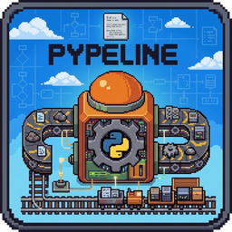
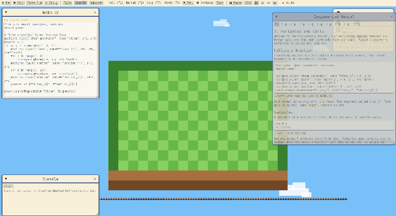
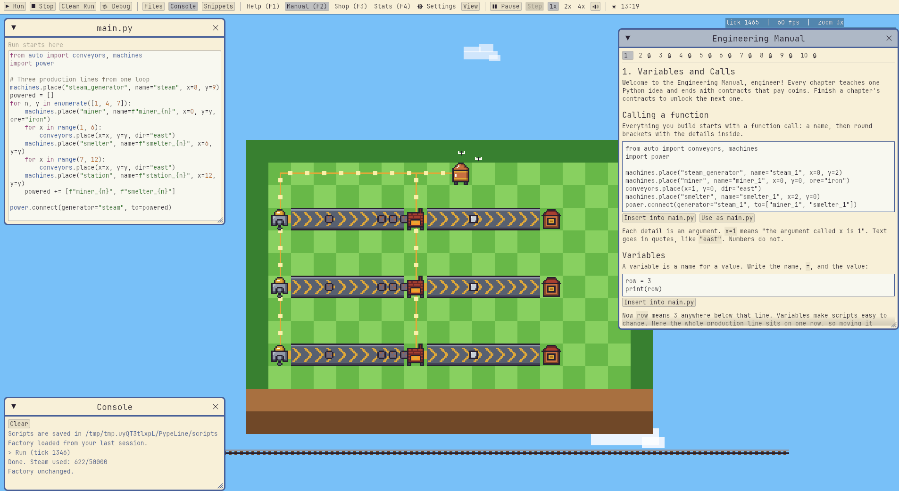
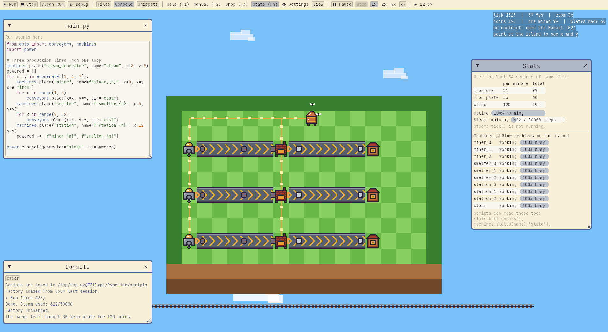
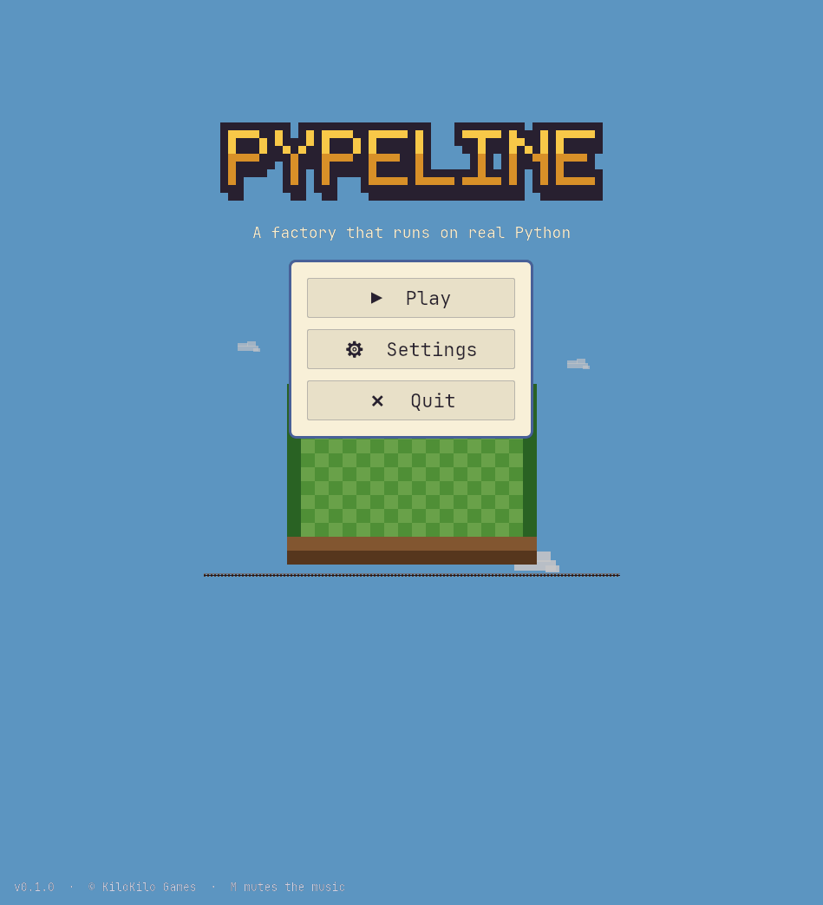
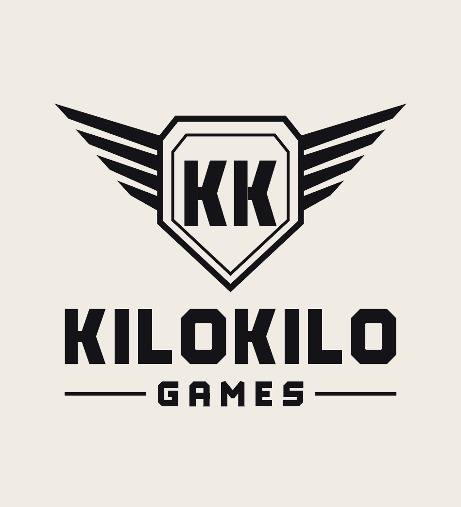

<div align="center">



# PypeLine

**Write real Python. Build factories. Learn to code.**

A cozy 16-bit, GBA-style automation game where your factory runs on Python you write yourself.

[](https://github.com/OGpisuars/PypeLine/actions/workflows/ci.yml)
[](https://github.com/OGpisuars/PypeLine/actions/workflows/release.yml)


[](LICENSE)

[**⬇ Download**](#-download-and-play) for Windows, macOS and Linux · [Build from source](#-build-from-source) · [Scripting API](PPL/pypeline/docs/API.md) · [Wiki](https://github.com/OGpisuars/PypeLine/wiki) · [Roadmap](#-roadmap)



</div>

---

## 📖 About

PypeLine blends the code-driven automation of *Factorio* and *The Farmer Was Replaced* with the warm, colorful look of classic handheld RPG overworlds.

You run a floating industrial island. Instead of placing every machine by hand, you write Python that builds your factory: miners, belts, smelters, steam power. Sell what you make to the cargo train, work through the Engineering Manual, and use each new idea (loops, functions, modules, generators) to build bigger and smarter factories.

```python
from auto import conveyors, machines
import power

machines.place("steam_generator", name="steam", x=8, y=9)
for n, y in enumerate([1, 4, 7]):
    machines.place("miner", name=f"miner_{n}", x=0, y=y, ore="iron")
    for x in range(1, 6):
        conveyors.place(x=x, y=y, dir="east")
    machines.place("smelter", name=f"smelter_{n}", x=6, y=y)
    power.connect(generator="steam", to=[f"miner_{n}", f"smelter_{n}"])
```

Press **Run** and the factory matches your script. Change it and run again: the game adds, updates and removes only what changed, and a script with an error changes nothing.

> **Status: pre-alpha.** Ten chapters are playable today. Features marked *planned* are designed but not built yet.

---

## 📥 Download and play

No Rust or building needed: every change to the game builds a fresh copy for each system.

| System | Download |
|--------|----------|
| 🪟 **Windows** 10 and 11 | [PypeLine-windows.zip](https://github.com/OGpisuars/PypeLine/releases/download/latest/PypeLine-windows.zip) |
| 🍎 **macOS** 11 or newer (Apple Silicon and Intel) | [PypeLine-macos.zip](https://github.com/OGpisuars/PypeLine/releases/download/latest/PypeLine-macos.zip) |
| 🐧 **Linux** (x86-64) | [PypeLine-linux.tar.gz](https://github.com/OGpisuars/PypeLine/releases/download/latest/PypeLine-linux.tar.gz) |

<details>
<summary><b>Windows:</b> how to start it</summary>

1. Unzip `PypeLine-windows.zip`.
2. Open the `PypeLine` folder and double-click `PypeLine.exe`.
3. If Windows SmartScreen says it protected your PC, click **More info**, then **Run anyway**. The game is not signed yet, so Windows does not know it.

</details>

<details>
<summary><b>macOS:</b> how to start it</summary>

1. Unzip `PypeLine-macos.zip` (double-click it in Finder).
2. Drag `PypeLine.app` into your **Applications** folder.
3. Open it. The game is not notarized by Apple yet, so the first time macOS blocks it:
   - **macOS 15 Sequoia and newer:** click **Done**, open **System Settings > Privacy & Security**, scroll down and click **Open Anyway** next to PypeLine, then confirm.
   - **macOS 14 and older:** right-click (or Control-click) `PypeLine.app`, choose **Open**, then **Open** again.

   Or, in Terminal: `xattr -dr com.apple.quarantine /Applications/PypeLine.app`

After the first time it opens normally.

</details>

<details>
<summary><b>Linux:</b> how to start it</summary>

```bash
tar -xzf PypeLine-linux.tar.gz
cd PypeLine
./pypeline
```

It needs a GPU driver with Vulkan and sound through ALSA, PulseAudio or PipeWire, which most desktops already have. It runs on X11 and Wayland, on Ubuntu 22.04 or anything newer. If it does not start, install the Vulkan driver (Debian/Ubuntu: `sudo apt install mesa-vulkan-drivers`; Arch: `sudo pacman -S vulkan-icd-loader` plus your GPU's Vulkan driver).

</details>

Your scripts and factory are saved on your computer, so a new download keeps your progress. All downloads are also on the [releases page](https://github.com/OGpisuars/PypeLine/releases/tag/latest). Stuck? The [wiki](https://github.com/OGpisuars/PypeLine/wiki) has a [troubleshooting page](https://github.com/OGpisuars/PypeLine/wiki/Troubleshooting).

---

## ✨ Features

<table>
<tr>
<td width="50%"></td>
<td width="50%"></td>
</tr>
<tr>
<td align="center"><sub>The Engineering Manual: lessons, examples you can insert, and contracts</sub></td>
<td align="center"><sub>Stats (F4): items per minute, steam, uptime and every machine's state</sub></td>
</tr>
<tr>
<td width="50%"></td>
<td width="50%"></td>
</tr>
<tr>
<td align="center"><sub>The title menu</sub></td>
<td align="center"><sub>The animated KiloKilo Games intro</sub></td>
</tr>
</table>

**Learn by building**
- **Real Python**, not a made-up language. Variables, f-strings, loops, functions, lists and dicts, modules, events, `tick()` and generators.
- **Engineering Manual (F2):** ten chapters and 22 contracts that pay coins and unlock the next chapter. Experienced coders can take each chapter's test to skip ahead.
- **Cheat sheet** with every import and function on one page, generated from the same lists as autocomplete so it is never out of date.
- **Help when stuck:** friendly error messages ("did you mean `conveyors`?"), hints that open one at a time, autocomplete, and snippets that unlock as you learn.
- **Line debugger (F6):** record a run and step through it forwards and backwards, with your variables shown.

**Run a real factory**
- **Miners, belts, splitters, smelters, crafters, steam power and a cargo train**, all placed by your code. Crafters turn plates into gears, pipes and engines, with recipes you unlock through achievements. Brass wires pulse to show what powers what.
- **`tick()` and events:** code that runs 20 times a second and reacts to train visits, with `sensors`, `stats` and `clock` to read the factory.
- **Day, night and hot boilers:** big boilers overheat at noon unless your script eases off.
- **Stats (F4)** with bottlenecks that blink on the island, and a **Shop** for faster belts, splitters and machines and bigger islands (up to 28 x 15).

**Made to be comfortable**
- **Code windows in the world:** like *The Farmer Was Replaced*, every file's window is part of the world. It pans and zooms with the island and stays where you park it, even far off screen. Open as many as you like, and brass cables link the files that import each other.
- **Code has a cost:** scripts run on a steam budget, so an infinite loop can never freeze the game.
- **Never lose work:** autosave, rolling backups and crash-safe writes.
- **Six themes, four fonts**, a matching mouse pointer, and your choice of music.

<details>
<summary><b>Planned for later</b></summary>

- **Cartridges:** your modules shown as physical carts you slot into terminals.
- **Micro-chips:** tiny chips on sorters and valves running fast local scripts (edge vs. central computing).
- **LED matrix panels:** control 8x8 and 16x16 pixel displays from Python.
- **Sandbox mode and blueprints.**
- **Prestige, with a new language each time:** start over with a permanent bonus while your scripts switch language, each fussier than the last: Python, Lua, JavaScript, a C-like language, a belt assembly language, and an esoteric finale.

</details>

---

## 🎮 Controls

| Key or button | What it does |
|---------------|--------------|
| Any key or click | Skip the logo |
| **Enter** or **▶ Play** | Start from the title menu |
| **▶ Run**, **Ctrl+Enter** or **F5** | Run `main.py` and update the factory to match |
| **Esc** or **☰ Menu** | Pause menu: Resume, Settings, Title screen, Quit |
| **F1** / **F2** / **F3** / **F4** | Help / Manual / Shop / Stats |
| **📋 Cheat sheet** | Every import and everything inside each module |
| **F6**, then **F7** / **F8** | Debug: record a run, then step back / forward |
| **Files > + New file** | Add a file (type `PPL` and it becomes `PPL.py`); use it with `import PPL` |
| Drag empty space / **mouse wheel** | Move / zoom the world (**Home** centers it again) |
| **Space** / **.** / **1 2 3** | Pause / step one tick / speed 1x 2x 4x |
| **M** | Sound on or off |

Every window can be dragged, resized and closed; the top bar brings it back. Scripts save as you type, and the factory every minute and when you quit.

---

## 🗺️ Roadmap

| Phase | Goal | Status |
|-------|------|--------|
| **0. Foundation** | Window, fixed tick, Python with a step budget, 3-OS CI | ✅ Done |
| **1. MVP** | First automated factory: belts, miners, smelters, power, editor | ✅ Done |
| **2. Alpha** | Floating island, polaroids, wires, train, saves, Time Dials, boot splash | ✅ Done |
| **3A. Teaching loop** | Manual chapters 1–7, contracts, friendly errors, snippets | ✅ Done |
| **3B. Beta tools** | Debugger, stats, day/night, chapters 8–10 | ✅ Code done, playtests next |
| **3C. Workspace** | Floating windows, many files, drag and zoom, Shop, Settings | ✅ Done |
| **3D. Web demo** | Play in the browser with nothing to install, made for classrooms | 🔜 Next |
| **4. 1.0** | Sandbox mode, blueprints, micro-chips, LED panels, real art, accessibility | 📝 Planned |
| **4B. Prestige** | Prestige resets with a bonus and a new language each time | 📝 Planned |
| **5. Post-launch** | Workshop sharing, leaderboards, the full game in the browser, more chapters | 📝 Planned |

The full plan, with the reasoning behind every decision, is in [`pypeline_roadmap.txt`](pypeline_roadmap.txt). What changed and when: [`CHANGELOG.md`](PPL/pypeline/CHANGELOG.md).

---

## 🛠️ How it works

| Layer | Choice | Why |
|-------|--------|-----|
| Language | **Rust** | Fast and safe, great for simulation |
| Engine | **[Bevy](https://bevyengine.org) 0.19** | Data-driven, with a fixed-timestep schedule |
| Scripting | **[RustPython](https://rustpython.github.io)** | Pure Rust, embeddable, and can be capped and stepped deterministically |
| UI | **[egui](https://github.com/emilk/egui)** via bevy_egui | Text editing and windows out of the box, themed to match the game |
| Content | **Markdown + RON** | Chapters and contracts are data files |

- **Deterministic.** A fixed 20 Hz simulation in integer math. The same script always gives the same factory, checked by a state hash on Windows, Linux and macOS in CI.
- **Sandboxed.** No Python standard library, refused dunders and dangerous built-ins, plus a step budget, a memory cap and a watchdog. Scripts cannot touch your files or network. See [`SANDBOX.md`](PPL/pypeline/docs/SANDBOX.md).
- **Tested content.** Every Manual example, every Help example and every contract's reference solution runs in CI.

More: [Architecture](PPL/pypeline/docs/ARCHITECTURE.md) · [Scripting API](PPL/pypeline/docs/API.md) · [Design decisions](PPL/pypeline/docs/DECISIONS.md) · [Art style](PPL/pypeline/docs/ART_STYLE.md)

---

## 🚀 Build from source

You only need this to change the game. To play, grab the [download](#-download-and-play) for your system.

**Requirements:** [Rust](https://www.rust-lang.org/tools/install) (the exact version is pinned in `rust-toolchain.toml` and installed automatically) and a GPU with Vulkan, Metal or DirectX 12. On Linux, also install the audio and input headers (Debian/Ubuntu: `sudo apt install libasound2-dev libudev-dev libwayland-dev libxkbcommon-dev`).

```bash
git clone https://github.com/OGpisuars/PypeLine.git
cd PypeLine/PPL/pypeline
cargo run --release
```

The first build compiles Bevy and RustPython and takes a while. On a machine with little memory, limit the parallel jobs: `cargo run --release -j 4`.

```bash
cargo test                                         # all tests
cargo run --bin headless -- path/to/main.py 600   # run a script for 600 ticks without a window
```

---

## 🗂️ Project structure

```text
PypeLine/
├── PPL/pypeline/          # The game (a Rust crate)
│   ├── src/
│   │   ├── factory/       # The deterministic simulation
│   │   ├── scripting/     # RustPython, the sandbox, game modules, hot-reload
│   │   ├── progression/   # Manual chapters, contracts, saves
│   │   ├── engine/        # Rendering, startup screens, egui UI
│   │   └── audio/         # Synthesized sound effects and music
│   ├── assets/            # Fonts, icon, music, Manual chapters and contracts
│   ├── tests/             # Determinism, sandbox, contracts, modules
│   └── docs/              # Architecture, API, sandbox, content guide, decisions
├── pypeline_roadmap.txt   # The full design and plan
└── .github/               # CI, release builds for every OS, issue templates
```

---

## 🤝 Contributing

Help is welcome, and you do not need to know Rust. New here? Start with an issue labeled [**good first issue**](https://github.com/OGpisuars/PypeLine/labels/good%20first%20issue).

- **Playtest**, especially if you are new to Python. Notes go in [`PLAYTEST.md`](PPL/pypeline/PLAYTEST.md).
- **Write Manual chapters and contracts:** they are Markdown and RON files. See the [content guide](PPL/pypeline/docs/CONTENT_GUIDE.md).
- **Try to break the sandbox**, and report what you find privately (see [`SECURITY.md`](SECURITY.md)).
- **Pixel art and music** in the project's style.

Please read [`CONTRIBUTING.md`](CONTRIBUTING.md) first, and open an issue before starting anything big.

---

## 📜 License and credits

- **Code:** [MIT](LICENSE).
- **Fonts, music and other assets:** see [`ASSET_LICENSES.md`](PPL/pypeline/ASSET_LICENSES.md).
- Made by **KiloKilo Games**.
- Inspired by *Factorio*, *The Farmer Was Replaced*, and the cozy overworlds of classic handheld RPGs.

PypeLine is an independent project. It is not affiliated with or endorsed by Nintendo, Game Freak or the Python Software Foundation. The GBA-inspired look is a style reference only; all art, music and names are original. "Python" is a trademark of the Python Software Foundation.
